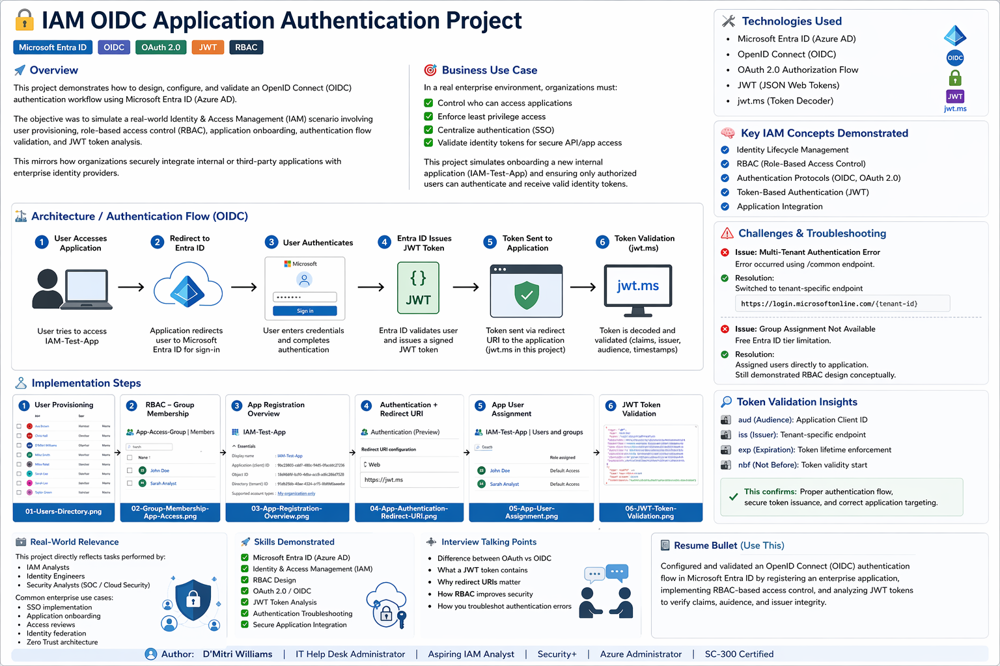
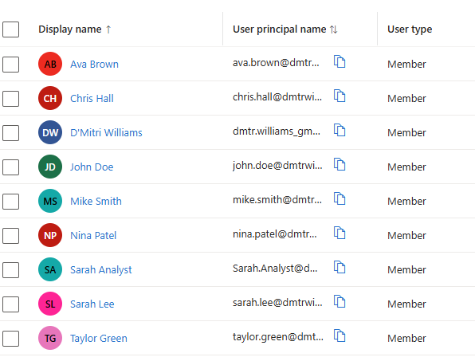
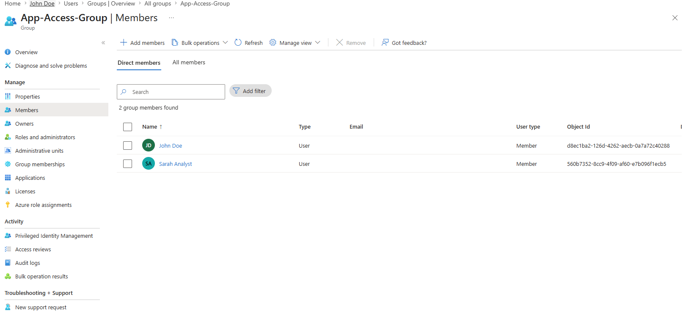
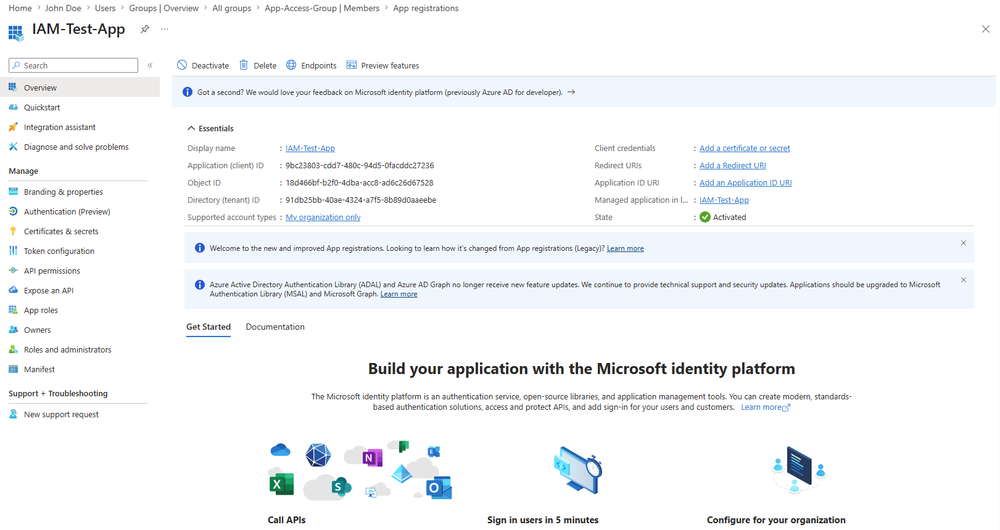
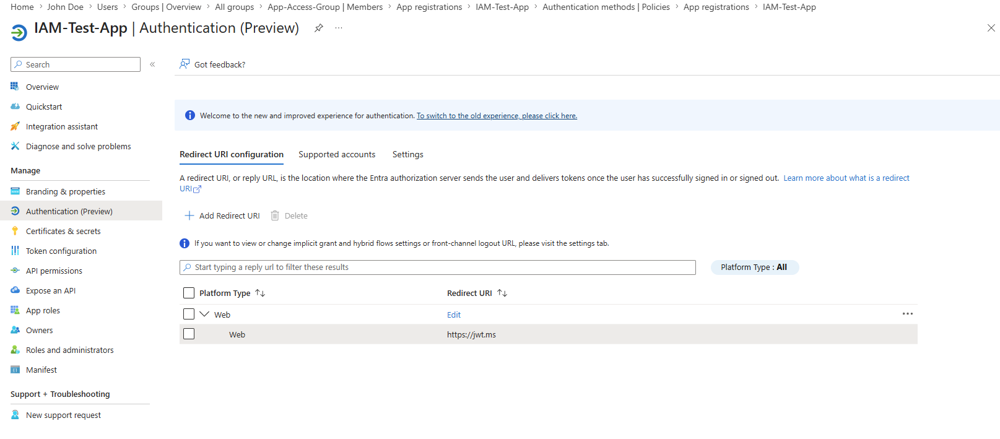
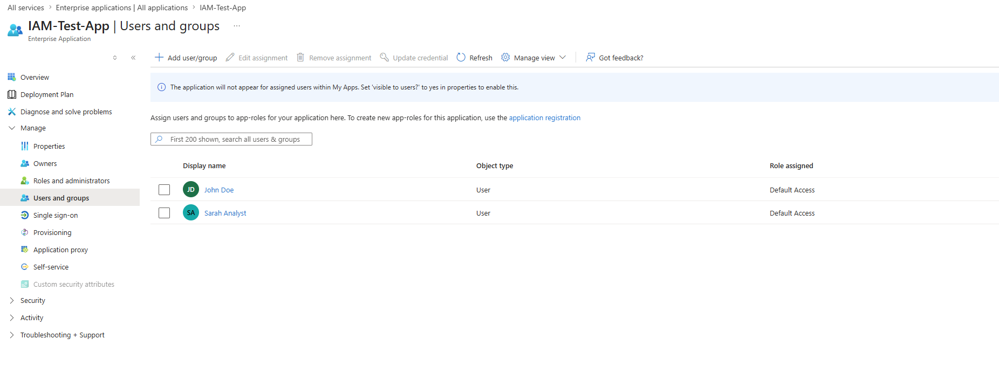
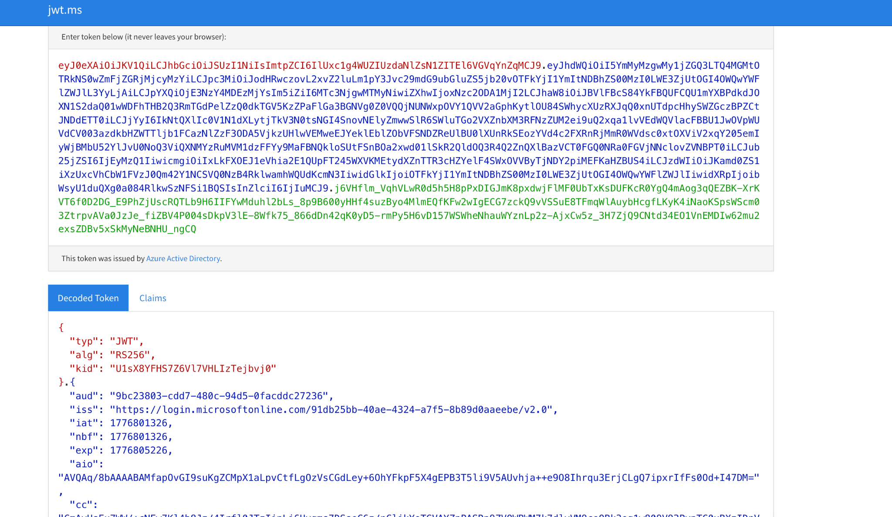

# Project 10 – IAM OIDC Application Authentication (Microsoft Entra ID)


---

## Overview

This project designs, configures, and validates an **OpenID Connect (OIDC) authentication workflow** using Microsoft Entra ID as the Identity Provider. It simulates a real-world IAM scenario involving user provisioning, RBAC group design, enterprise application onboarding, OIDC authentication configuration, and JWT token validation — mirroring how organizations securely integrate internal applications with an enterprise identity platform.

> **Application Registered:** IAM-Test-App
> **Authentication Flow:** OIDC via OAuth 2.0 → JWT issued by Entra ID → validated at jwt.ms

---

## Architecture — OIDC Authentication Flow


*Full OIDC authentication flow — user access → Entra ID redirect → authentication → JWT issuance → token validation*

**Flow:**
1. User attempts to access **IAM-Test-App**
2. Redirected to Microsoft Entra ID login
3. User authenticates with credentials
4. Entra ID issues a signed **JWT token**
5. Token delivered to application via Redirect URI (`https://jwt.ms`)
6. Token decoded and claims validated — audience, issuer, expiration, nbf confirmed

---

## Environment

| Tool | Purpose |
|------|---------|
| Microsoft Entra ID (Azure AD) | Identity Provider — user directory, app registration, token issuance |
| OpenID Connect (OIDC) | Authentication protocol layered over OAuth 2.0 |
| OAuth 2.0 Authorization Flow | Authorization framework for token-based access |
| JWT (JSON Web Tokens) | Identity token format issued by Entra ID |
| jwt.ms | Browser-based JWT decoder for token validation |
| Azure Portal | GUI for all configuration steps |
| GitHub | Documentation and version control |

---

## Business Use Case

In a real enterprise environment, organizations must:
- Control who can access applications
- Enforce least privilege access
- Centralize authentication (SSO)
- Validate identity tokens for secure API and application access

This project simulates onboarding **IAM-Test-App** as a new internal application and ensuring only authorized users can authenticate and receive valid identity tokens.

---

## Implementation Steps

---

### 🟢 Step 1 — User Provisioning

**Actions Taken:**
1. Provisioned test users in Microsoft Entra ID for the authentication scenario
2. Confirmed user directory — 9 total users including new test user **Sarah Analyst**
3. Verified all users set as **Member** type with correct UPN format

**Users in Directory:**
| User | Type |
|------|------|
| Ava Brown | Member |
| Chris Hall | Member |
| D'Mitri Williams | Member |
| John Doe | Member |
| Mike Smith | Member |
| Nina Patel | Member |
| Sarah Analyst | Member (new) |
| Sarah Lee | Member |
| Taylor Green | Member |


*Entra ID user directory — all provisioned users confirmed including Sarah Analyst*

---

### 🔵 Step 2 — RBAC Group Design (App-Access-Group)

**Actions Taken:**
1. Created security group: **App-Access-Group**
2. Added John Doe and Sarah Analyst as direct members
3. Confirmed 2 group members — group designed to represent role-based application access

> **Note:** Free Entra ID tier does not support group-based app assignment. Users were assigned directly to the application. The group design was implemented to demonstrate RBAC architecture and conceptual access modeling.

**Group Members:**
| User | Type | Object ID |
|------|------|-----------|
| John Doe | Member | d8ec1ba2-126d-4262-aecb-0a7a72c40288 |
| Sarah Analyst | Member | 560b7352-8cc9-4f09-af60-e7b096f1ecb5 |


*App-Access-Group — 2 direct members (John Doe, Sarah Analyst) confirmed*

---

### 🟡 Step 3 — Application Registration

**Actions Taken:**
1. Registered new application in Entra ID App Registrations: **IAM-Test-App**
2. Set supported account types: **My organization only** (single tenant)
3. Captured and documented application identifiers

**Application Identifiers:**
| Property | Value |
|----------|-------|
| Application Name | IAM-Test-App |
| Application (Client) ID | 9bc23803-cdd7-480c-94d5-0facddc27236 |
| Object ID | 18d466bf-b2f0-4dba-acc8-ad6c26d67528 |
| Directory (Tenant) ID | 91db25bb-40ae-4324-a7f5-8b89d0aaeebe |
| Supported Account Types | My organization only (Single Tenant) |
| State | ✅ Activated |


*IAM-Test-App registered in Entra ID — Client ID, Tenant ID, and Object ID confirmed*

---

### 🟠 Step 4 — Authentication Configuration & Redirect URI

**Actions Taken:**
1. Navigated to IAM-Test-App → **Authentication (Preview)**
2. Added Web platform with Redirect URI: `https://jwt.ms`
3. Confirmed redirect URI registered — Entra ID will deliver JWT tokens to jwt.ms after authentication

**Configuration:**
| Setting | Value |
|---------|-------|
| Platform Type | Web |
| Redirect URI | `https://jwt.ms` |


*Authentication configuration — Web platform with https://jwt.ms redirect URI confirmed*

---

### 🔴 Step 5 — User Assignment to Application

**Actions Taken:**
1. Navigated to IAM-Test-App (Enterprise Application) → **Users and groups**
2. Assigned John Doe and Sarah Analyst directly to the application
3. Confirmed both users assigned with **Default Access** role

**Assigned Users:**
| User | Object Type | Role Assigned |
|------|------------|---------------|
| John Doe | User | Default Access |
| Sarah Analyst | User | Default Access |


*IAM-Test-App Users and groups — John Doe and Sarah Analyst assigned with Default Access*


*User assignment confirmed — both users visible in enterprise application assignment list*

---

### 🟣 Step 6 — JWT Token Validation

**Actions Taken:**
1. Initiated OIDC authentication flow using tenant-specific endpoint:
   ```
   https://login.microsoftonline.com/91db25bb-40ae-4324-a7f5-8b89d0aaeebe/oauth2/v2.0/authorize
   ```
2. Authenticated as assigned user — Entra ID issued signed JWT token
3. Token delivered to `https://jwt.ms` via redirect URI
4. Decoded and validated all token claims

**JWT Token Claims Validated:**
| Claim | Value | Verification |
|-------|-------|-------------|
| `typ` | JWT | ✅ Correct token type |
| `alg` | RS256 | ✅ Signed with RSA SHA-256 |
| `aud` | 9bc23803-cdd7-480c-94d5-0facddc27236 | ✅ Matches Client ID |
| `iss` | https://login.microsoftonline.com/91db25bb.../v2.0 | ✅ Matches Tenant ID |
| `iat` | 1776801326 | ✅ Issued at timestamp |
| `nbf` | 1776801326 | ✅ Not before timestamp |
| `exp` | 1776805226 | ✅ Expiration — 1 hour from issuance |


*jwt.ms decoded JWT — aud matches Client ID, iss matches Tenant ID, RS256 signature, timestamps confirmed*

---

## Troubleshooting Scenarios

| Issue | Root Cause | Resolution |
|-------|-----------|------------|
| Multi-tenant authentication error | Used `/common` endpoint — not supported for single-tenant app | Switched to tenant-specific endpoint: `https://login.microsoftonline.com/{tenant-id}` |
| Group assignment unavailable | Free Entra ID tier limitation — group-based app assignment requires P1/P2 license | Assigned users directly to application; RBAC group design retained for architectural demonstration |

---

## Screenshot Naming Reference

| File Name | Description |
|-----------|-------------|
| `IAM_OIDC_Diagram.png` | Full OIDC architecture and project overview diagram |
| `01-users-created_png.png` | Entra ID user directory — all provisioned users confirmed |
| `02-group-members.png` | App-Access-Group members — John Doe and Sarah Analyst |
| `03-app-registration.png` | IAM-Test-App registration — Client ID, Tenant ID, Object ID |
| `04-App-Group-Assignment.png` | Authentication configuration — Web platform, jwt.ms redirect URI |
| `05-App-User-Assignment.png` | IAM-Test-App user assignment — John Doe and Sarah Analyst |
| `06-App-User-Assignment.png` | User assignment confirmed — both users with Default Access |
| `Step-7-JWT-Token-Validation.png` | jwt.ms decoded JWT — all claims validated |

---

## Key IAM Concepts Demonstrated

| Concept | How It Was Applied |
|---------|--------------------|
| Identity Lifecycle Management | Provisioned users and managed access through the full app onboarding workflow |
| RBAC Design | Designed App-Access-Group to represent role-based access — applied conceptually with direct assignment as free-tier workaround |
| OIDC Authentication | Configured and executed full OpenID Connect flow from app registration to token issuance |
| OAuth 2.0 | Leveraged OAuth 2.0 authorization framework as the underlying protocol for OIDC |
| JWT Token Analysis | Decoded and validated all claims — audience, issuer, expiration, not-before, algorithm |
| Application Integration | Registered and configured a single-tenant enterprise application with redirect URI handling |
| Authentication Troubleshooting | Diagnosed and resolved multi-tenant endpoint error by switching to tenant-specific endpoint |

---

## Skills Demonstrated

| Skill | How It Was Applied |
|-------|--------------------|
| Microsoft Entra ID | App registration, user provisioning, group design, enterprise application assignment |
| OIDC / OAuth 2.0 | Configured full authorization flow with redirect URI and token delivery |
| JWT Token Analysis | Validated aud, iss, iat, nbf, exp, alg claims using jwt.ms |
| RBAC Design | Designed group-based access model aligned with least privilege |
| Authentication Troubleshooting | Resolved multi-tenant error and free-tier group assignment limitation |
| Secure Application Integration | Onboarded enterprise application with controlled user access and token validation |
| Documentation | Structured evidence-based write-up with architecture diagram and token validation evidence |

---

## Lessons Learned

**The endpoint matters.** Using the `/common` endpoint for a single-tenant application causes an authentication error immediately. Switching to the tenant-specific endpoint — `https://login.microsoftonline.com/{tenant-id}` — resolved it. In production, every app registration should be validated against the correct endpoint for its account type before deployment.

**JWT claims are the proof of authentication, not just the result.** Seeing a successful redirect to jwt.ms confirms the flow worked. Reading the decoded token — verifying `aud` matches the Client ID, `iss` matches the Tenant ID, and `exp` is 3,900 seconds from `iat` — confirms the token was issued correctly for the right application by the right identity provider. Those claims are what a security engineer validates in a real application integration.

**Free-tier constraints are real-world constraints.** Group-based application assignment requires an Entra ID P1 or P2 license. Hitting that wall, documenting the workaround, and still demonstrating the RBAC architecture conceptually is the same decision-making process IAM engineers make when working within organizational licensing limits. The design still matters even when the automation isn't available.

---

## Repository Structure

```text
Project-12-IAM-OIDC-Authentication/
├── Project Screenshots/
│   ├── IAM_OIDC_Diagram.png
│   ├── 01-users-created_png.png
│   ├── 02-group-members.png
│   ├── 03-app-registration.png
│   ├── 04-App-Group-Assignment.png
│   ├── 05-App-User-Assignment.png
│   ├── 06-App-User-Assignment.png
│   └── Step-7-JWT-Token-Validation.png
└── README.md
```

---

## References

- [Microsoft Entra ID — App Registration](https://learn.microsoft.com/en-us/entra/identity-platform/quickstart-register-app)
- [OpenID Connect on Microsoft Identity Platform](https://learn.microsoft.com/en-us/entra/identity-platform/v2-protocols-oidc)
- [JWT Token Claims Reference](https://learn.microsoft.com/en-us/entra/identity-platform/access-token-claims-reference)
- [jwt.ms Token Decoder](https://jwt.ms)
- [NIST SP 800-63 Digital Identity Guidelines](https://pages.nist.gov/800-63-3/)
